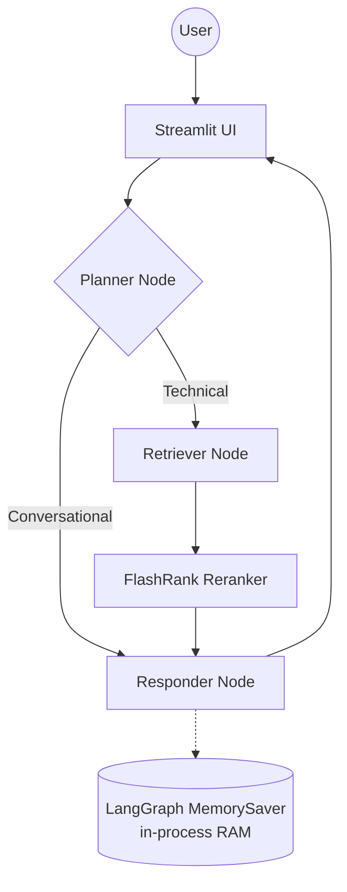

# Enterprise RAG System

This is an enterprise grade RAG System that can be deployed in GCP with the following features:
- **Agentic Intelligence** — LangGraph cyclic graph: Planner → Retriever → Responder with persistent memory across sessions
- **Memory** - Using LangGraph MemorySaver - In memory storage for conversation history
- **Embedding** - Using Vertex AI Embedding for embedding
- **Vector Store** - Using Qdrant for vector storage
- **LLM** - Using Groq's `openai/gpt-oss-120b` for LLM
- **Ingestion** - Using DocAI for document ingestion and preprocessing
- **RAG** - Using LangChain for RAG pipeline
- **Re-Ranker** - For better retrieval results using FlashRank

## Architecture

### Monolithic

The original single-process application — all components in one container, in-memory state, manual ingestion.

